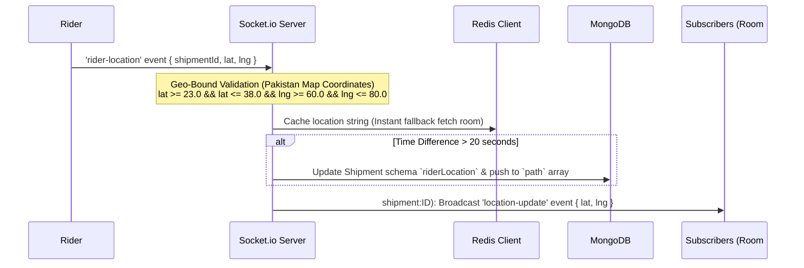

# Pharmix — B2B Pharmaceutical Platform (Full Codebase Documentation)

This document provides a comprehensive mapping of the **Pharmix** codebase, detailing its features, frontend, backend, routes, controllers, database models, WebSockets, and design system.

---

## Technology Stack
The platform is built using a modern, scalable, and type-safe architecture:

### Frontend
* **Core Framework**: React 18+ with Vite and TypeScript.
* **Routing**: `@tanstack/react-router` (Type-safe file-based client-side router).
* **Server State**: `@tanstack/react-query` (Synchronizes, caches, and updates server state in the UI).
* **Client State Management**: `zustand` (Persists authentication sessions, active theme configurations, and shopping multi-carts in localStorage).
* **Styling & Components**: Tailwind CSS v4, customized shadcn/ui components, and Lucide React icons.
* **Payments Gateway**: Stripe Elements (`@stripe/react-stripe-js`) for secure, tokenized card payments.
* **Logistics Map Layer**: Leaflet & React-Leaflet for real-time rider tracking and geographic breadcrumb renders.

### Backend
* **Runtime & Framework**: Node.js with Express.js.
* **Programming Language**: Vanilla JavaScript (ES6+).
* **Database**: MongoDB with Mongoose ODM (Object Document Mapper) for structured schema validation.
* **Caching & Real-Time Storage**: Redis (used for coordinates caching, API throttling, and debouncing database writes).
* **Duplex Communication**: Socket.io (coordinates real-time rider GPS tracking streams and target role/entity-based push notifications).
* **Security & Auth**: JSON Web Tokens (JWT) for stateless requests authentication, bcryptjs for secure password hashing.
* **Payment Processing**: Stripe SDK for creating Stripe Payment Intents.

---

## Design System & Theme Aesthetics
Pharmix implements a premium, high-density, and reactive design language with support for a dark mode default experience:

### Theme & Color Palette
* **Color Spaces**: Built fully using the high-fidelity **OKLCH** color format (supporting wide gamuts and consistent perceptual lightness).
* **Primary Branding**: A rich, vibrant purple/indigo theme (`oklch(0.58 0.16 277)`).
* **Default Theme**: Dark Mode by default (`oklch(0.13 0.01 270)`) with a clean light mode alternative, switching smooth transition backdrops.
* **Elevation & Layering**: Elevated surfaces (`.surface`, `.surface-2`, `.surface-3`) map to specific UI elements like sidebars, cards, and dropdown overlays.

### Typography & Layout
* **Typography**: Styled with **Inter** sans-serif font family, enhanced with subpixel anti-aliasing and custom letter-spacing tags like `.tracking-tightest` (`-0.04em`).
* **Backgrounds**: The landing page features a dynamic grid texture (`.grid-bg` rendering 48px lines) blended with a radial mask fade-out overlay (`.radial-fade`).
* **Micro-Animations & Gestures**:
  * Smooth transition states for themes and interactions.
  * Active beacon alerts utilizing the infinite keyframe animation `.pulse-dot`.
  * Logistical loading loaders styled with linear-gradient `.shimmer` skeletons.

---

## 1. System Overview & Architecture Flow
Pharmix is a multi-role B2B Pharmaceutical Supply Chain and logistics management platform. The platform supports five primary roles:
1. **Admin**: Oversees the entire network, creates and resets users, links/unlinks partners, and monitors global platform metrics.
2. **Manufacturer**: Manages medicine catalogs, performs stock updates (with a dedicated Stock History audit trail), processes incoming orders, links delivery partners, and assigns shipments.
3. **Pharmacy**: Places orders (utilizing multi-carts grouped by manufacturer), checks out using Stripe Elements, tracks local inventory levels, and monitors purchase alerts.
4. **Customer**: Accesses a limited catalog to search and place orders, performs secure checkouts, and tracks order shipments on a live map.
5. **Delivery (Riders)**: Views assigned delivery routes, registers pickup events, records GPS breadcrumbs, and updates delivery statuses.

---

## 2. Model Schemas (Database Models)
Pharmix backend MongoDB (Mongoose) models and their core fields are mapped below:

### 1. `User` (`models/User.js`)
Controls user authentication, credentials, and access configuration:
* `id` (String, Unique, Required) - Unique identifier prefixed with `usr`.
* `email` (String, Unique, Required) - User login email address.
* `password` (String, Required) - Bcrypt hashed password.
* `role` (String, Required) - One of `admin`, `manufacturer`, `pharmacy`, `delivery`, `customer`.
* `name` (String, Required) - Display name of the user.
* `entityId` (String) - Mapped profile or business entity reference (MFR/PHR/DLV).
* `linkedEntities` (Array of Strings) - List of linked partner IDs.

### 2. `Medicine` (`models/Medicine.js`)
Maintains catalog SKUs for pharmaceutical manufacturers:
* `id` (String, Unique, Required) - Unique identifier prefixed with `MED`.
* `name` (String, Required) - Medicine brand name.
* `category` (String, Required) - Therapeutic category.
* `manufacturer` (String, Required) - Manufacturer business name.
* `manufacturerId` (String, Required) - Linked manufacturer entity ID.
* `batch` (String, Required) - Production batch number.
* `price` (Number, Required) - Unit price.
* `stock` (Number, Required, Default: 0) - Current stock quantity at the warehouse.
* `expiry` (String, Required) - Expiry date string.
* `rx` (Boolean, Default: false) - Prescription-only flag.
* `description` (String) - Medicine details and composition.

### 3. `Order` (`models/Order.js`)
Logs transactions and order details between pharmacies and manufacturers:
* `id` (String, Unique, Required) - Unique identifier prefixed with `ORD`.
* `pharmacyId` (String, Required) - Ordering pharmacy entity ID.
* `manufacturerId` (String, Required) - Target manufacturer entity ID.
* `items` (Array of items: `{ medicineId, name, price, qty }`) - Ordered items.
* `subtotal` (Number, Required) - Sum of item costs before fees.
* `shippingFee` (Number, Required) - Shipping fee based on manufacturer configurations.
* `tax` (Number, Default: 0) - Calculated tax.
* `total` (Number, Required) - Total billing amount.
* `status` (String, Enum: `pending`, `processing`, `shipped`, `delivered`, `cancelled`) - Processing state.
* `paymentStatus` (String, Enum: `pending`, `paid`, `failed`) - Stripe transaction status.
* `stripePaymentIntentId` (String) - Stripe intent identifier.
* `expectedDeliveryDate` (Date) - Dynamic delivery date calculated based on order thresholds.
* `deliveredAt` (Date) - Actual delivery timestamp.
* `deliveryStatus` (String, Enum: `on-time`, `late`, `pending`) - SLA validation tag.

### 4. `Shipment` (`models/Shipment.js`)
Tracks active logistics operations and physical shipment updates:
* `id` (String, Unique, Required) - Unique identifier prefixed with `SHP`.
* `orderId` (String, Required) - Reference to the corresponding order.
* `manufacturerId` (String, Required) - Origin manufacturer entity ID.
* `pharmacyId` (String, Required) - Destination pharmacy entity ID.
* `riderId` (String, Required) - Assigned delivery partner entity ID.
* `origin` (String, Required) - Warehouse address.
* `destination` (String, Required) - Delivery address.
* `status` (String, Enum: `pickup`, `in_transit`, `delivered_pending`, `delivered`) - Current phase.
* `riderLocation` (`{ lat, lng, updatedAt }`) - Real-time cached GPS coordinate.
* `trackingEvents` (Array of `{ type: String (start/stop), timestamp }`) - Trip event logs.
* `path` (Array of `{ lat, lng, timestamp }`) - Rider route breadcrumbs trace.

### 5. `Cart` (`models/Cart.js`)
Preserves the items state in a pharmacy's cart before check out:
* `pharmacyId` (String, Required) - Owner identifier.
* `manufacturerId` (String, Required) - Target manufacturer identifier.
* `items` (Array of `{ medicineId, name, price, qty }`) - Cart items.
* `tax` (Number, Default: 0) - Estimated tax.
* Index: `{ pharmacyId: 1, manufacturerId: 1 }` (Enforces unique cart per manufacturer per pharmacy).

### 6. `Pharmacy` (`models/Pharmacy.js`)
Maintains pharmacy profile details and configuration settings:
* `id`, `name`, `region`, `email`, `phone`, `address`, `status`, `joinedDate`, `description`, `linkedManufacturers` (Array of linked manufacturer IDs).

### 7. `Manufacturer` (`models/Manufacturer.js`)
Maintains manufacturer profile details and shipping configuration settings:
* `id`, `name`, `region`, `email`, `phone`, `address`, `status`, `joinedDate`, `linkedDeliveryPartners`, `shippingFee` (Default: 500 PKR), `deliveryConfig` (dynamic timeline parameters based on small, medium, and large orders).

### 8. `DeliveryPartner` (`models/DeliveryPartner.js`)
Maintains rider profiles and delivery statistics:
* `id`, `name`, `email`, `phone`, `vehicle`, `zone`, `status`, `joinedDate`, `rating`, `totalDeliveries`, `linkedManufacturers`.

### 9. `LinkHistory` (`models/LinkHistory.js`)
Tracks relationship linking actions performed by administrators:
* `id`, `sourceId`, `sourceType`, `targetId`, `targetType`, `status` (`active` or `unlinked`), `linkedAt`, `unlinkedAt`, `linkedBy` (Admin user ID).

### 10. `StockHistory` (`models/StockHistory.js`)
Maintains an auditing ledger for all inventory adjustments:
* `id`, `medicineId`, `medicineName`, `manufacturerId`, `oldQty`, `newQty`, `type` (`manual` or `order`), `referenceId`, `changedBy`, `role`, `createdAt`.

### 11. `Payment` (`models/Payment.js`)
Logs financial transaction details linked to orders:
* `id`, `stripePaymentIntentId`, `orderId`, `amount`, `status`, `manufacturerId`, `pharmacyId`, `paymentMethod`.

### 12. `AnalyticsCache` (`models/AnalyticsCache.js`)
Caches aggregated analytics for performance optimization:
* `manufacturerId` (or `SYSTEM_ADMIN` identifier), `revenueData`, `categoryData`, `deliveryData`, `lastUpdated`.

### 13. `PharmacyInventory` (`models/PharmacyInventory.js`)
Tracks local stock levels inside a pharmacy after a shipment is successfully delivered:
* `pharmacyId`, `medicineId`, `name`, `category`, `price`, `stock`, `expiry`, `manufacturerId`.

---

## 3. Router & Controller Functions Mapping

### **1. Auth Module (`/api/auth`)**
* File: `routes/authRoutes.js` ➔ `controllers/authController.js`
* Routes & Logic:
  * `POST /login` ➔ `login`: Authenticates credentials and roles. If the role is `admin`, it first checks for **Super Admin** credentials (`SUPER_ADMIN_EMAIL`/`SUPER_ADMIN_PASSWORD`) which grants unrestricted access with `isSuperAdmin: true` in the JWT payload. If the email matches but password check fails, it returns `Invalid Super Admin Credentials`. If those don't match, it verifies against the standard admin environment configuration (`ADMIN_EMAIL`/`ADMIN_PASSWORD`). For all other roles, it queries the database users collection. Generates a stateless JWT token containing user context.
  * `POST /logout` ➔ `logout`: A stateless endpoint that confirms token invalidation on the client side.
  * `GET /check` ➔ `checkAuth`: Verifies the validity of the client token using the verification middleware.

### **2. Users Module (`/api/users`)**
* File: `routes/userRoutes.js` ➔ `controllers/userController.js`
* Routes & Logic:
  * `GET /` ➔ `getUsers`: Retrieves all user profiles and calculates metrics like active SKUs and linked partners for administrators.
  * `GET /entities/:role` ➔ `getEntitiesByRole`: Retrieves entity choices based on the requested user role during creation.
  * `POST /` ➔ `createUser`: Creates a new user profile. System IDs are generated via unique string patterns, and a temporary secure alphanumeric password is dynamically generated and returned upon creation.
  * `POST /reset-password` ➔ `resetPassword`: Resets a user's password to a newly generated temporary secure string.
  * `GET /linked-manufacturers` ➔ `getLinkedManufacturers`: Fetches manufacturers linked to the authenticated pharmacy.
  * `GET /linked-delivery` ➔ `getLinkedDelivery`: Fetches delivery partners linked to the authenticated manufacturer.
  * `GET /linked-pharmacies` ➔ `getLinkedPharmacies`: Fetches pharmacies linked to the authenticated manufacturer.

### **3. Medicines Module (`/api/medicines`)**
* File: `routes/medicineRoutes.js` ➔ `controllers/medicineController.js`
* Routes & Logic:
  * `GET /` ➔ `getMedicines`: Fetches medicine lists filtered by role. Pharmacies and customers are served a subset of catalog details (e.g., hiding warehouse batch codes).
  * `GET /:id` ➔ `getMedicineDetails`: Fetches comprehensive details of a single medicine profile, restricted by role permissions.
  * `POST /` ➔ `createMedicine`: Creates a new medicine profile. Validates fields and generates a `MED`-prefixed identifier.
  * `PUT /:id` ➔ `updateMedicine`: Updates existing catalog entries. Modifying the stock quantity automatically appends a new trace entry inside the `StockHistory` database collection.
  * `GET /inventory-stats` ➔ `getInventoryStats`: Aggregates inventory statistics including expiring medicines (within 90 days) and low-stock SKUs.
  * `GET /pharmacy-inventory` ➔ `getPharmacyInventory`: Fetches local warehouse inventories of the authenticated pharmacy.

### **4. Carts Module (`/api/cart`)**
* File: `routes/cartRoutes.js` ➔ `controllers/cartController.js`
* Routes & Logic:
  * `GET /` ➔ `getCarts`: Fetches active carts for the pharmacy and dynamically hydrates shipping fees for each manufacturer.
  * `POST /add` ➔ `addToCart`: Appends quantities or initializes new cart indexes separated by supplier.
  * `POST /update` ➔ `updateCartItem`: Updates item quantities. Setting quantity to zero automatically drops the item and clears empty carts.
  * `POST /clear` ➔ `clearCart`: Clears cart instances for either a specific manufacturer or all manufacturers.

### **5. Orders Module (`/api/orders`)**
* File: `routes/orderRoutes.js` ➔ `controllers/orderController.js`
* Routes & Logic:
  * `POST /payment-intent` ➔ `createPaymentIntent`: Initializes Stripe Element payment intents and returns the client secret along with the total billing amount.
  * `POST /confirm` ➔ `createOrder`: Validates cart contents, updates database records, logs successful payments, and schedules automatic notification alerts.
  * `GET /` ➔ `getOrders`: Retrieves historic orders filtered by the requester's user role.
  * `GET /:id` ➔ `getOrderById`: Fetches detailed metadata of a specific order.
  * `PATCH /:id/status` ➔ `updateOrderStatus`: Controls order status state transitions. Marking an order as `shipped` automatically generates a new physical `Shipment` assignment, and marking it as `delivered` processes inventory deductions.

### **6. Shipments Module (`/api/shipments`)**
* File: `routes/shipmentRoutes.js` ➔ `controllers/shipmentController.js`
* Routes & Logic:
  * `GET /` ➔ `getShipments`: Retrieves logistical tracking records filtered by participant roles.
  * `GET /:id` ➔ `getShipmentById`: Compiles shipment details with associated rider, order, and stakeholder metadata.
  * `PATCH /:id/status` ➔ `updateShipmentStatus`: Updates transport status states. Moving a shipment to `delivered` by a rider triggers a `delivered_pending` state awaiting confirmation.
  * `POST /:id/approve` ➔ `approveShipment`: Approves pending deliveries, finalizing the order status and adding products to the pharmacy's local inventory cache.
  * `POST /:id/events` ➔ `addTrackingEvent`: Appends active timeline status logs.
  * `GET /riders/:manufacturerId` ➔ `getLinkedRiders`: Fetches active riders linked to a specific manufacturer.

### **7. Link Module (`/api/links`)**
* File: `routes/linkRoutes.js` ➔ `controllers/linkController.js`
* Routes & Logic:
  * `POST /` ➔ `linkEntities`: Validates and creates active entity links (e.g., preventing invalid direct links between pharmacies and riders).
  * `POST /relink` ➔ `relinkEntities`: Restores unlinked relationships back to an active state.
  * `DELETE /:linkId` ➔ `unlinkEntities`: Deactivates a relationship and updates associated entity listings.
  * `GET /history` ➔ `getLinkHistory`: Retrieves full historical audits of relationship configurations.

### **8. Payments Module (`/api/payments`)**
* File: `routes/paymentRoutes.js` ➔ `controllers/paymentController.js`
* Routes & Logic:
  * `GET /` ➔ `getPayments`: Retrieves transaction history logs filtered by role.
  * `GET /:id` ➔ `getPaymentById`: Fetches invoice details for a specific payment.
  * `POST /webhook` ➔ `handleStripeWebhook`: Processes Stripe webhook notifications, confirming payments and initializing logs.

---

## 4. WebSockets & Real-Time Tracking Flow

Live logistics monitoring runs directly via `Socket.io` inside `server.js`:

### Core WebSockets Channels:
* `join-entity (Room: entity:${entityId})`: Targets specific user/profile socket rooms.
* `join-role (Room: role:${role})`: Targets system-wide role-based rooms.
* `join-shipment (Room: shipment:${shipmentId})`: Binds client-rider tracking update streams.

---

## 5. Frontend Pages & Routing Layout

The TanStack Router maps directory structures directly to application pages:

1. **Global Wrapper (`routes/__root.tsx`)**: Initializes query clients, verifies active token sessions, sets the active theme, and wraps toast notifications.
2. **Landing Page (`routes/index.tsx`)**: Displays product introduction, system modules overview, and pricing guides.
3. **Login View (`routes/login.tsx`)**: Provides login form structures and handles submission events.
4. **App Shell (`components/app-shell.tsx`)**: Shell layout wrapper. Renders dynamic sidebar links according to active user roles and displays real-time summary notifications.
   * **Dashboard (`routes/app.dashboard.tsx`)**: Presents role-specific key performance metrics and live logs widgets.
   * **Catalog (`routes/app.medicines.index.tsx` & `$id.tsx`)**: Interactive catalog grid, filters, and role-based action triggers.
   * **Inventory (`routes/app.inventory.tsx`)**: Tracks warehouse stocks, local store inventory levels, and warning thresholds.
   * **Orders (`routes/app.orders.index.tsx` & `$id.tsx`)**: Fulfillment list dashboard, status color badges, and interactive rider assignment triggers.
   * **Shipments (`routes/app.shipments.index.tsx` & `$id.tsx`)**: Active logistics tracker, status actions, and verification flows.
   * **Deliveries (`routes/app.deliveries.index.tsx` & `$id.tsx`)**: Assigned pickup lists and path guidance panels for riders.
   * **Live Tracking (`routes/app.tracking.index.tsx` & `$id.tsx`)**: Live tracking map showing current coordinates and trace path.
   * **Payments (`routes/app.payments.index.tsx` & `$id.tsx`)**: Billing logs, payments summaries, and receipt links.
   * **Users (`routes/app.users.index.tsx`)**: Admin portal to manage profiles and reset credentials.
   * **Partners (`routes/app.partners.index.tsx`)**: Visualizes entity networks and exposes linking tools.
   * **Analytics (`routes/app.analytics.tsx`)**: Displays revenue trends, category demands, and logistics SLA gauges.
   * **Reports (`routes/app.reports.tsx`)**: Generates CSV, Excel, and PDF reports.
   * **Cart & Checkout (`routes/app.cart.tsx` & `app.checkout.tsx`)**: Multi-cart checkout summaries and Stripe credit card elements forms.

---

## 6. Production Demo Mode & Security Enhancements

When `NODE_ENV=production` is set in the environment, the platform enters **Demo Mode Protection** to secure the application during public client presentations and portfolio reviews.

### Demo Mode Rules:
1. **One-Time Creation Limit**: Restricts all resource creations (POST routes like Users, Medicines, Orders, Links) to exactly one document in the database per type to prevent spam/database abuse.
2. **Device POST Throttling**: Restricts every unique device (identified by `x-device-id` header generated in frontend localStorage) to exactly one successful POST write request. Subsequent POST requests receive a `403` error.
3. **Update & Delete Disabling**: Disables all PUT and PATCH updates, and blocks all DELETE operations for every user role, returning a clear error response.
4. **Redis Cache-Aside**: GET requests query the Redis cache first. If a cache miss or timeout occurs, the server falls back to MongoDB. The cache is automatically invalidated or updated immediately when records are added or modified.
5. **Autofill Demo Credentials**: If in production, the login page fetches active demo credentials from the backend via `/api/auth/demo-credentials` and renders a neat copy/autofill panel.
6. **Audit Action Logs**: All allowed and blocked actions are logged with timestamp, user ID, IP address, and route details to a text file `logs/demo-actions.log` and a queryable MongoDB `DemoLog` collection.
7. **Admin Logs & Analytics Dashboard**: Admin users gain access to a dedicated logs viewer route (`/app/logs`) presenting paginated action tables and visual allowed-vs-blocked charts.
8. **Express Throttling**: Limits POST/PUT/PATCH/DELETE writes to 10 req/min/IP and GET reads to 100 req/min/IP.
9. **Industry Security Standards**: Integrates Helmet headers, MongoDB query sanitization, HTML XSS scrubbing, and strict payload size limits (1MB).
10. **Super Admin Bypass**: A dedicated Super Admin account (`SUPER_ADMIN_EMAIL`/`SUPER_ADMIN_PASSWORD` in `.env`) completely bypasses all demo mode restrictions listed above. When authenticated with these credentials, the JWT token includes `isSuperAdmin: true`, and all middlewares (`blockDeleteOperations`, `restrictUpdates`, `checkCreateLimit`, `checkDevicePostLimit`, and inline shipment limits) skip their restrictions. The `/app/logs` page is exclusively accessible to this Super Admin.

---

## 7. Coding & Flow Patterns Summary

* **State Preservation Rules**: User session checks on app loads to verify credentials via token verification.
* **Separation of Concerns**: Business logic is separated into individual controllers away from Express routes, while schemas are structured individually in the models directory.
* **Permission Constraints**: Requests are verified on the backend using auth middlewares and role-based route endpoints mapping configs.
* **Auditing Consistency**: Every manual stock change automatically logs a history entry within the `StockHistory` audit ledger.
